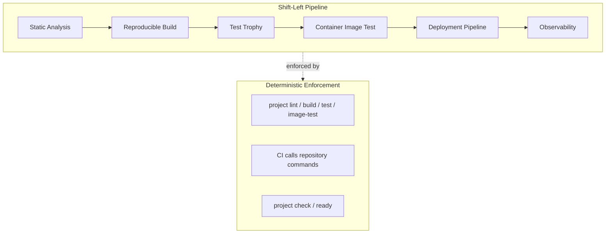
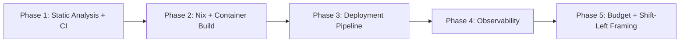

# Plan: Shift-Left Pipeline, Static Analysis, Build, Deployment, Observability

**Status:** proposed
**Author:** architect mode
**Date:** 2026-08-01

## Problem

A project generated from this scaffold omitted static analysis early. The
template currently treats `lint` as an unspecialised stub with no skill guidance,
no CI pipeline shape, and no per-runtime tool opinion. The template also lacks
explicit guidance for:

- Nix-first reproducible builds combined with container builds;
- deployment pipelines catered for from the start (evolvable to Lambda etc.);
- observability designed for prod with local instrumentation;
- a qualitative budget scale to keep early delivery a success criterion.

The user wants the mindset baked in: shift left from the get-go, closing infra
risk, build-the-right-thing risk, and build-it-right risk, with deterministic
repeatable enforcement.

## Design principles

1. **Opinionated about categories, not hard-pinned to specific tools.** The
   skill mandates analysis *categories* (lint, type-check, security/dead-code,
   complexity). Per-runtime tool suggestions are evolvable defaults with
   deprecation revisit triggers — not per-tool shims.
2. **Deterministic enforcement.** The `lint` command and CI pipeline enforce
   whatever the project chose, repeatably and deterministically.
3. **Nix-first, container-capable.** Reproducible builds via Nix; container
   builds as the deployable artefact when applicable; both can evolve.
4. **Catered from the start, evolvable later.** Deployment pipeline and
   observability are recorded as explicit decisions from `/specialise`, even
   when deferred, with concrete revisit triggers.
5. **Small, testable, reversible increments.** Each phase is independently
   mergeable.
6. **Preserve existing architecture.** No broad refactors. Provider isolation,
   command surface, context router, and skill catalog conventions are preserved.

## Architecture



## Phase 1: Static analysis + CI pipeline

**Goal:** make static analysis a first-class, opinionated, deterministically
enforced part of every generated project from `/specialise`.

### 1.1 New skill: `specialise/static-analysis`

Path: `.agents/skills/specialise/static-analysis/SKILL.md`

**Content shape:**

- **Policy:** every generated project must make an explicit static-analysis
  decision after `/specialise`. The decision covers required categories, not
  specific tools.
- **Required categories** (opinionated defaults):
  - `lint` — style and convention enforcement;
  - `type_check` — static type checking where the runtime supports it;
  - `security_scan` — dependency vulnerability and code security scanning;
  - `complexity` — cyclomatic/cognitive complexity or dead-code detection.
- **Per-runtime tool suggestion table** (evolvable, not authoritative):

  | Runtime | lint | type_check | security | complexity |
  |---|---|---|---|---|
  | Java | Checkstyle / PMD | compiler + NullAway | SpotBugs / OWASP Dep-Check | PMD |
  | Node/TS | ESLint | tsc --noEmit | npm audit / audit-ci | ESLint complexity rules |
  | Python | ruff | mypy / pyright | pip-audit / bandit | ruff / radon |
  | Rust | clippy | compiler | cargo-audit | clippy |
  | Elixir | credo | dialyzer | mix audit | credo |
  | Ruby | RuboCop | Sorbet (if adopted) | bundler-audit | RuboCop |
  | Godot | GDScript warnings | built-in | n/a | n/a |

- **Evolvability:** tools are recorded in `PROJECT_PROFILE.toon.static_analysis`
  with a `revisit_trigger` (e.g. "tool deprecated", "better OSS alternative
  emerges", "language version upgrade"). The skill explicitly warns against
  upstream deprecation risk and recommends recording the upstream health signal.
- **No per-tool shims:** the skill provides guidance, not scripts. The project
  specialises `project lint` to call its chosen tools.
- **Do not:** hard-pin tools in the template; leave `lint` unspecialised after
  `/specialise`; add every category when the runtime does not support it (record
  `not_applicable` with a reason).

### 1.2 Update `specialise/ci` skill

Add `lint` to the canonical pipeline shape:

```text
project check
project lint                 # NEW: static analysis gate
project test
project integration-test     # when applicable
project image-test           # when applicable
project compose-config       # when applicable
project infra-check          # when applicable
project ready                # or the non-duplicating composite
```

Add guidance:
- run `lint` early and in parallel with `test` where the CI runner supports it,
  for fast feedback;
- lint must fail the pipeline on violations (not warn-only) unless the project
  explicitly records a warn-only policy with a revisit trigger;
- CI must not duplicate lint configuration — it calls `project lint`.

### 1.3 Wire `lint` into command surface

- [`project`](.agentic-template/bin/project:46): `lint` is already in
  `UNSPECIALISED`. No change needed to the dispatch — it already fails clearly.
  Add `lint` to `OPTIONAL_COMMANDS` is **not** needed; lint is expected for
  most projects. Libraries and Godot projects may mark it `not_applicable`.
- [`check-repo-contract`](.agentic-template/bin/check-repo-contract:128):
  `lint` is already in `PROJECT_COMMANDS`. Add `specialise/static-analysis` to
  `REQUIRED_SKILLS`.
- `project check` / `project ready`: no change to the template's own check
  (the template has no runtime to lint). Generated projects wire `lint` into
  their own `check` / `ready` during specialisation.

### 1.4 Update AGENTS.md

- **Quality and technical debt** section: add a bullet that static analysis is
  a standing obligation, not a phase, and that `project lint` enforces it
  deterministically.
- **Canonical commands** table: add `lint` row (it is already in the
  unspecialised set; make the shift-left intent explicit in the table notes).
- **Testing expectations** section: add static analysis as a shift-left gate
  that runs before tests in CI.

### 1.5 Update CUSTOMIZE_THIS_PROJECT.toon

Add a `static_analysis` block:

```toon
static_analysis:
  categories:
    lint: infer
    type_check: infer
    security_scan: infer
    complexity: infer
  tools: infer
  revisit_trigger: tool_deprecation_or_better_alternative
  enforce_in_ci: true
```

### 1.6 Update PROJECT_PROFILE.toon

Add a decision and profile state shape:

```toon
decisions:
  - id: static_analysis_from_specialise
    decision: every generated project makes an explicit static-analysis decision at /specialise
    reason:
      - shift-left: catch defects before tests and review
      - deterministic enforcement via project lint and CI
      - evolvable tool choices with deprecation revisit triggers
    confidence: medium
    status: active
    validation:
      - .agents/skills/specialise/static-analysis/SKILL.md
      - .agentic-template/bin/project lint
    consequence_if_changed: static analysis may be omitted or ad hoc
```

### 1.7 Update wiki

- [`testing.md`](docs/wiki/method/testing.md): add a "Static analysis" section
  framing it as a shift-left gate that runs before tests.
- [`development.md`](docs/wiki/method/development.md): add `project lint` to the
  development lifecycle diagram.
- [`glossary.md`](docs/wiki/method/glossary.md): add terms: static analysis,
  shift-left, lint gate, complexity budget.

### 1.8 Update AGENTS_TEMPLATE.md

Add static analysis to the required sections list (section 7 or a new section
between Testing and Container).

### 1.9 Update check-repo-contract

- Add `specialise/static-analysis` to `REQUIRED_SKILLS`.
- `lint` is already in `PROJECT_COMMANDS`.

### 1.10 Tests

- `test_repo_contract.py` (or equivalent): assert `specialise/static-analysis`
  skill exists and has valid frontmatter.
- `test_scaffold_acceptance.py`: assert `lint` is in the command surface.
- New or extended test: assert the CI skill mentions `lint` in its pipeline
  shape.

### 1.11 Validation

```sh
.agentic-template/bin/project check
.agentic-template/bin/project self-test
.agentic-template/bin/project ready
git diff --check
```

---

## Phase 2: Nix-first + container build pipeline

**Goal:** make reproducible builds a first-class concern, with Nix as the
source of truth for developer tooling and container builds as the deployable
artefact.

### 2.1 New skill: `specialise/build-pipeline`

Path: `.agents/skills/specialise/build-pipeline/SKILL.md`

**Content shape:**

- **Policy:** every generated project makes an explicit build decision at
  `/specialise`. Nix owns the developer toolchain; the container build produces
  the deployable artefact when applicable.
- **Nix-first build:** the `flake.nix` provides a reproducible build
  environment. The build command (`project build`) produces artefacts
  deterministically.
- **Container build:** when a deployable service, the container build uses the
  Nix environment (or a multi-stage Dockerfile) to produce a pinned,
  reproducible image. Base images are evolvable — record the base image and a
  revisit trigger.
- **Evolvability:** the build target may evolve (container, Lambda zip, static
  binary, etc.). Record the target and revisit trigger in
  `PROJECT_PROFILE.toon.build`.
- **Required artifacts:** `project build` command; `Dockerfile` or
  `Containerfile` when applicable; pinned base image or documented update
  policy; `project image` / `project image-test` when applicable.
- **Do not:** leave `build` unspecialised after `/specialise` for deployable
  services; commit unpinned base images without an update policy; duplicate
  build logic between Nix and Dockerfile.

### 2.2 Update container-build skill

Cross-reference the build-pipeline skill. The container build is one build
target, not the only one.

### 2.3 Update CI skill

Add `build` to the canonical pipeline shape:

```text
project check
project lint
project build              # NEW
project test
...
```

### 2.4 Update command surface

- Add `build` to `UNSPECIALISED` in [`project`](.agentic-template/bin/project:46).
- Add `build` to `PROJECT_COMMANDS` in
  [`check-repo-contract`](.agentic-template/bin/check-repo-contract:128).
- Add `specialise/build-pipeline` to `REQUIRED_SKILLS`.

### 2.5 Update profile/customise state

```toon
build:
  nix_first: true
  target: infer          # container | lambda_zip | static_binary | not_applicable
  container_base_image: infer
  revisit_trigger: deployment_target_change_or_base_image_deprecation
  enforce_in_ci: true
```

### 2.6 Tests and validation

- Assert `build` is in command surface.
- Assert `specialise/build-pipeline` skill exists with frontmatter.
- Run `project check`, `project self-test`, `project ready`.

---

## Phase 3: Deployment pipeline (catered from the start, evolvable)

**Goal:** every generated project records a deployment pipeline decision from
`/specialise`, even when deferred, with a concrete revisit trigger.

### 3.1 New skill: `specialise/deployment-pipeline`

Path: `.agents/skills/specialise/deployment-pipeline/SKILL.md`

**Content shape:**

- **Policy:** every project records a deployment pipeline decision at
  `/specialise`. The decision may be `deferred` but must have a concrete
  revisit trigger.
- **Deployment targets are evolvable:** container deploy, Lambda, Fly, static
  host, etc. The skill provides a decision framework, not a fixed target.
- **Promotion model:** record the promotion path (e.g. build → test → image →
  push → deploy). Even a manual promotion path is recorded.
- **Required state:**

  ```toon
  deployment:
    pipeline:
      status: required | deferred | not_applicable
      target: container | lambda | fly | static | unknown
      promotion: automated | manual | deferred
      revisit_trigger: ...
    cd_tool: infer    # GitHub Actions, ArgoCD, etc.
  ```

- **Do not:** leave deployment implicit; provision infrastructure from generic
  template CI; require cloud credentials for static validation.

### 3.2 Extend infra-decision skill

Cross-reference the deployment-pipeline skill. The infra-decision records IaC;
the deployment-pipeline records the CD flow.

### 3.3 Update profile/customise state

Add `deployment` block to `CUSTOMIZE_THIS_PROJECT.toon` and
`PROJECT_PROFILE.toon`.

### 3.4 Tests and validation

- Assert `specialise/deployment-pipeline` skill exists with frontmatter.
- Run `project check`, `project self-test`, `project ready`.

---

## Phase 4: Observability (design for prod, local instrumentation)

**Goal:** every generated project records an observability decision from
`/specialise`, with guidance for local instrumentation.

### 4.1 New skill: `specialise/observability`

Path: `.agents/skills/specialise/observability/SKILL.md`

**Content shape:**

- **Policy:** every project records an observability decision at
  `/specialise`. The decision covers traces, structured logs, and metrics.
- **Observability 2.0 framing:** prefer OpenTelemetry (OTel) for traces and
  metrics; structured JSON logs with correlation IDs; local instrumentation
  that works in dev and CI, not just prod.
- **Local instrumentation:** the dev shell and container should emit traces/logs
  to a local collector (e.g. OTel collector, Jaeger UI) for debugging. This is
  a dev-time concern, not a prod-only afterthought.
- **Per-runtime guidance:** lightweight, not shims. Suggest OTel SDK per
  runtime; structured logging library per runtime.
- **Required state:**

  ```toon
  observability:
    traces: infer       # otel | none
    logs: structured    # structured | plain
    metrics: infer      # otel | prometheus | none
    local_collector: infer
    revisit_trigger: ...
  ```

- **Do not:** add a full APM SaaS by default; require a running collector for
  local dev (make it opt-in); log sensitive data.

### 4.2 Update wiki operations.md

Add observability guidance: traces, logs, metrics, local collector, correlation
IDs.

### 4.3 Update profile/customise state

Add `observability` block to `CUSTOMIZE_THIS_PROJECT.toon` and
`PROJECT_PROFILE.toon`.

### 4.4 Tests and validation

- Assert `specialise/observability` skill exists with frontmatter.
- Run `project check`, `project self-test`, `project ready`.

---

## Phase 5: Budget scale + shift-left framing

**Goal:** add a qualitative budget scale and explicit shift-left framing to keep
early delivery a success criterion.

### 5.1 Budget scale

Add to `CUSTOMIZE_THIS_PROJECT.toon`:

```toon
budget:
  appetite: infer    # constrained | moderate | comfortable | generous
  notes: null
```

Add to `PROJECT_PROFILE.toon`:

```toon
budget:
  appetite: ...
  influence_on_right_sizing: ...
  revisit_trigger: ...
```

**Guidance:** the budget appetite influences right-sizing decisions. A
`constrained` budget means the smallest sufficient architecture is mandatory
and scope must be aggressively thin-sliced. A `generous` budget allows more
headroom but does not justify over-engineering.

### 5.2 Shift-left framing in AGENTS.md

Add a "Shift-left engineering" section (or extend Quality/Testing) covering:

- **Infra risk:** container, IaC, and deployment decisions are explicit from
  `/specialise`, not deferred silently.
- **Build-the-right-thing risk:** specs, acceptance scenarios, and ATDD ensure
  the project builds the right thing.
- **Build-it-right risk:** static analysis, testing trophy, fitness functions,
  and deterministic CI enforcement ensure the project builds it right.
- **Design for prod:** observability is recorded from the start, not bolted on.

### 5.3 Update wiki

- [`development.md`](docs/wiki/method/development.md): add shift-left framing to
  the lifecycle.
- [`glossary.md`](docs/wiki/method/glossary.md): add budget appetite, shift-left,
  observability 2.0.

### 5.4 Tests and validation

- Assert `budget` block exists in `CUSTOMIZE_THIS_PROJECT.toon` schema.
- Run `project check`, `project self-test`, `project ready`.

---

## Phase ordering and dependencies



Each phase is independently mergeable. Phase 1 is the highest priority and
directly addresses the reported gap. Phases 2-5 build on the command surface
and skill catalog conventions established in Phase 1.

## Files touched per phase

### Phase 1

| File | Change |
|---|---|
| `.agents/skills/specialise/static-analysis/SKILL.md` | New |
| `.agents/skills/specialise/ci/SKILL.md` | Add lint to pipeline shape |
| `.agents/skills/CATALOG.toon` | Add static-analysis entry |
| `AGENTS.md` | Add static analysis to Quality/Testing/Commands |
| `CUSTOMIZE_THIS_PROJECT.toon` | Add static_analysis block |
| `PROJECT_PROFILE.toon` | Add static_analysis decision |
| `.agentic-template/templates/AGENTS_TEMPLATE.md` | Add static analysis section |
| `.agentic-template/bin/check-repo-contract` | Add static-analysis to REQUIRED_SKILLS |
| `docs/wiki/method/testing.md` | Add static analysis section |
| `docs/wiki/method/development.md` | Add lint to lifecycle |
| `docs/wiki/method/glossary.md` | Add new terms |
| `.agentic-template/tests/` | Add/update tests |

### Phase 2

| File | Change |
|---|---|
| `.agents/skills/specialise/build-pipeline/SKILL.md` | New |
| `.agents/skills/specialise/container-build/SKILL.md` | Cross-reference |
| `.agents/skills/specialise/ci/SKILL.md` | Add build to pipeline shape |
| `.agents/skills/CATALOG.toon` | Add build-pipeline entry |
| `.agentic-template/bin/project` | Add build to UNSPECIALISED |
| `.agentic-template/bin/check-repo-contract` | Add build to PROJECT_COMMANDS, build-pipeline to REQUIRED_SKILLS |
| `CUSTOMIZE_THIS_PROJECT.toon` | Add build block |
| `PROJECT_PROFILE.toon` | Add build decision |
| `AGENTS.md` | Add build to commands |
| `.agentic-template/tests/` | Add/update tests |

### Phase 3

| File | Change |
|---|---|
| `.agents/skills/specialise/deployment-pipeline/SKILL.md` | New |
| `.agents/skills/specialise/infra-decision/SKILL.md` | Cross-reference |
| `.agents/skills/CATALOG.toon` | Add deployment-pipeline entry |
| `.agentic-template/bin/check-repo-contract` | Add deployment-pipeline to REQUIRED_SKILLS |
| `CUSTOMIZE_THIS_PROJECT.toon` | Add deployment block |
| `PROJECT_PROFILE.toon` | Add deployment decision |
| `.agentic-template/tests/` | Add/update tests |

### Phase 4

| File | Change |
|---|---|
| `.agents/skills/specialise/observability/SKILL.md` | New |
| `docs/wiki/product/operations.md` | Add observability guidance |
| `.agents/skills/CATALOG.toon` | Add observability entry |
| `.agentic-template/bin/check-repo-contract` | Add observability to REQUIRED_SKILLS |
| `CUSTOMIZE_THIS_PROJECT.toon` | Add observability block |
| `PROJECT_PROFILE.toon` | Add observability decision |
| `.agentic-template/tests/` | Add/update tests |

### Phase 5

| File | Change |
|---|---|
| `CUSTOMIZE_THIS_PROJECT.toon` | Add budget block |
| `PROJECT_PROFILE.toon` | Add budget decision |
| `AGENTS.md` | Add shift-left section |
| `docs/wiki/method/development.md` | Add shift-left framing |
| `docs/wiki/method/glossary.md` | Add budget/shift-left/observability terms |
| `.agentic-template/tests/` | Add/update tests |

## Risks

- **Skill proliferation:** five new skills may feel heavy. Mitigation: each is
  a single SKILL.md with lean guidance, no shims, consistent with existing
  runtime skills.
- **Tool deprecation:** per-runtime tool suggestions may go stale. Mitigation:
  every tool suggestion carries a `revisit_trigger` and the skill explicitly
  warns about upstream deprecation.
- **Template bloat:** adding blocks to CUSTOMIZE/PROFILE increases
  specialisation surface. Mitigation: blocks use `infer` defaults and are
  optional where the runtime does not support them.
- **Conformance check churn:** adding to REQUIRED_SKILLS and PROJECT_COMMANDS
  may break existing fixtures. Mitigation: update fixtures in the same change;
  run `project self-test` which exercises the fixture.

## Not changing

- The context router, qualification system, and scaffold mechanism.
- Provider isolation rules.
- The TOON/S-expression structured-data policy.
- The existing testing trophy and ATDD guidance (extended, not replaced).
- The existing container-build and infra-decision skills (cross-referenced,
  not merged).
